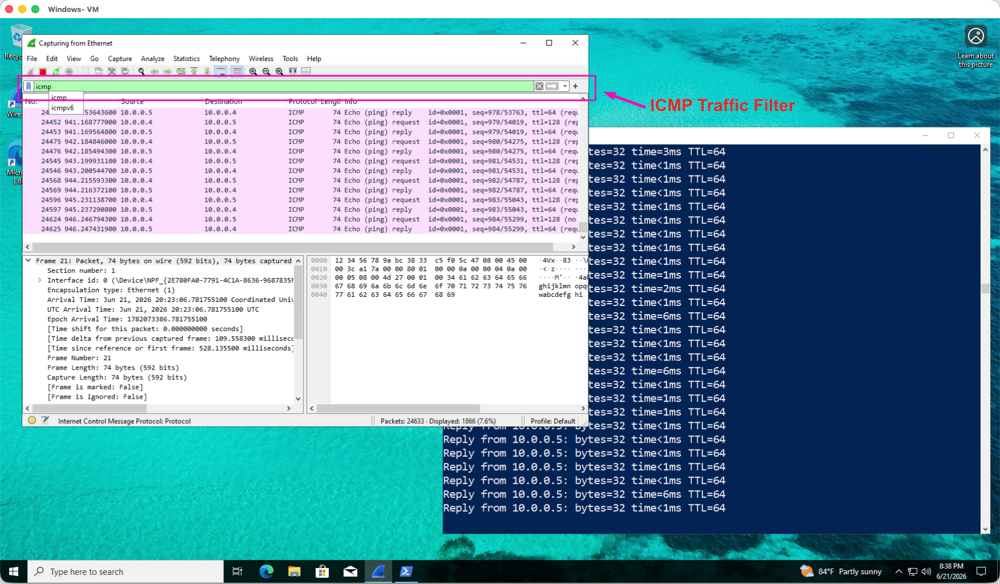
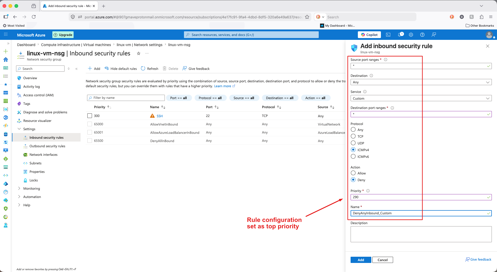
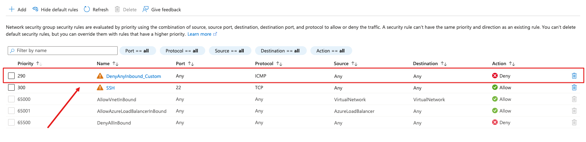
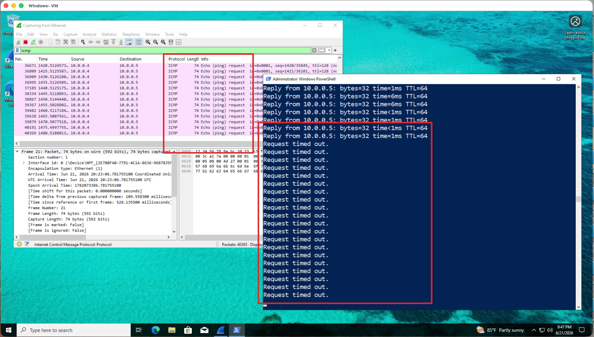

# Network Security Groups (NSGs) and Inspecting Network Protocols

## Project Overview
This project focuses on securing cloud infrastructure and gaining visibility into network traffic. It demonstrates the ability to apply firewall rules to protect virtual assets and inspect network packets to troubleshoot connectivity and security issues.

## Key Skills Demonstrated
* **NSG Management:** Configured inbound and outbound security rules to restrict traffic to specific protocols.
* **Network Traffic Analysis:** Used diagnostic tools to capture and analyze traffic (TCP/UDP) for troubleshooting.
* **Firewall Logic:** Implemented the principle of least privilege by allowing only necessary traffic.

## Implementation Steps
1. Created an Azure Virtual Network and deployed Virtual Machines.
2. Configured Network Security Groups (NSGs) to control inbound/outbound traffic.
3. Configured Network Security Groups (NSGs) with custom rules to control traffic flow.
4. Validated security rule effectiveness by using ping (ICMP) and Wireshark to verify that traffic was successfully blocked.

## Project Evidence - Click to enlarge images

## Project Evidence

### 1. Wireshark Before Rule

Initiated perpetual ping to Linux VM from Windows 10 VM, filtering for ICMP traffic. Observed utilizing WireShark

### 2. Azure NSG Configuration

Configured new inbound security rule within Azure for Linux VM to restrict traffic.

### 3. Azure Rule Close-up

New rule successfully added, set as highest priority

### 4. Traffic Blocked (After)

Validation of denied traffic. Azure NSG successfully dropped the ICMP packets, confirmed by "Request timed out" messages in the command prompt and no response traffic in Wireshark.

